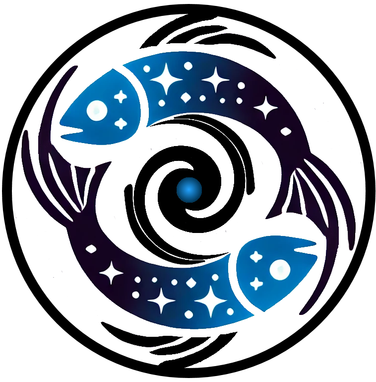

Pisces
=========

|yt-project| |docs| |testing| |Github Page| |Pylint| |coverage|

.. raw:: html

   

Pisces (or Py-ICs) is an initial conditions generator software for astrophysical simulations and modeling. Pisces is capable of
producing models of galaxies, galaxy clusters, early universe perturbations, and other useful systems either for use in their
own right, or for export to simulation software. To ensure compatibility with emerging simulation softwares, Pisces maintains
frontends which allow for easy interoperability between itself and all of the major simulation softwares.

This repository contains the core package, which is constructed modularly to facilitate easy development by users to meet
particular scientific use cases. All of the necessary tools to get started building initial conditions are provided.

Development occurs here on Github, if you encounter any bugs, issues, documentation failures, or want to suggest features, we recommend that you submit an issue on
the issues page of the repository.

.. raw:: html

   

Resources
=========

.. grid:: 2
    :padding: 3
    :gutter: 5

    .. grid-item-card::
        :img-top: _images/index/stopwatch_icon.png

        Quickstart Guide
        ^^^^^^^^^^^^^^^^
        New to ``cluster_generator``? The quickstart guide is the best place to start learning to use all of the
        tools that we have to offer!

        +++

        .. button-ref:: getting_started
            :expand:
            :color: secondary
            :click-parent:

            To The Quickstart Page

    .. grid-item-card::
        :img-top: _images/index/lightbulb.png

        Examples
        ^^^^^^^^
        Have some basic experience with ``cluster_generator``, but want to see a guide on how to execute a particular task? Need
        to find some code to copy and paste? The examples page contains a wide variety of use case examples and explainations
        for all of the various parts of the ``cluster_generator`` library.

        +++

        .. button-ref:: examples
            :expand:
            :color: secondary
            :click-parent:

            To the Examples Page

    .. grid-item-card::
        :img-top: _images/index/book.svg

        User References
        ^^^^^^^^^^^^^^^^
        The user guide contains comprehensive, text based explainations of the backbone components of the ``cluster_generator`` library.
        If you're looking for information on the underlying code or for more details on particular aspects of the API, this is your best resource.

        +++

        .. button-ref:: codes
            :expand:
            :color: secondary
            :click-parent:

            To the User Guide

    .. grid-item-card::
        :img-top: _images/index/api_icon.png

        API Reference
        ^^^^^^^^^^^^^

        Doing a deep dive into our code? Looking to contribute to development? The API reference is a comprehensive resource
        complete with source code and type hinting so that you can find every detail you might need.

        +++

        .. button-ref:: api
            :expand:
            :color: secondary
            :click-parent:

            API Reference

Contents
========
.. raw:: html

   

.. toctree::
   :maxdepth: 1

   api

Indices and tables
==================

.. raw:: html

   

* :ref:`genindex`
* :ref:`modindex`
* :ref:`search`

.. |yt-project| image:: https://img.shields.io/static/v1?label="works%20with"&message="yt"&color="blueviolet"
   :target: https://yt-project.org

.. |docs| image:: https://img.shields.io/badge/docs-latest-brightgreen.svg
   :target: https://jzuhone.github.io/cluster_generator/build/html/index.html

.. |testing| image:: https://github.com/Eliza-Diggins/cluster_generator/actions/workflows/test.yml/badge.svg
.. |Pylint| image:: https://github.com/Eliza-Diggins/cluster_generator/actions/workflows/pylint.yml/badge.svg
.. |Github Page| image:: https://github.com/Eliza-Diggins/cluster_generator/actions/workflows/docs.yml/badge.svg
.. |coverage| image:: https://coveralls.io/repos/github/Eliza-Diggins/cluster_generator/badge.svg
   :target: https://coveralls.io/github/Eliza-Diggins/cluster_generator